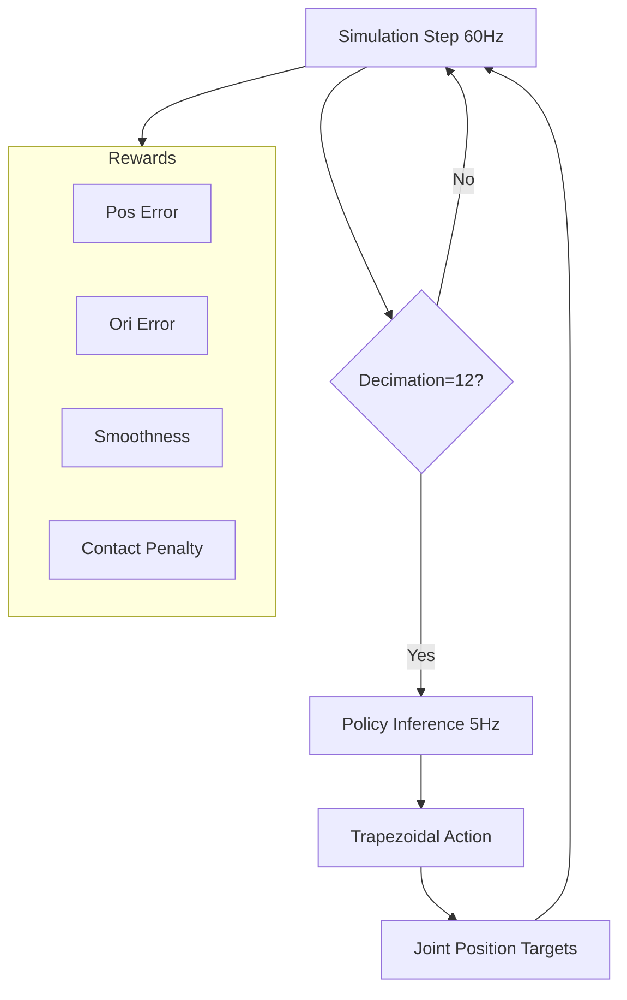

# Technical Specification: Isaac Lab Lynx Reach Environment

This document defines the configuration for the Lynx robot reach task in Isaac Lab, incorporating findings from MuJoCo code analysis and specific task requirements.

## 1. Scene Configuration

The scene consists of the Lynx robot mounted on a table, a target marker, and necessary sensors.

| Component | Asset Type | Prim Path | Details |
|-----------|------------|-----------|---------|
| **Robot** | `ArticulationCfg` | `{ENV_REGEX_NS}/Robot` | `LYNX_CFG_TCP` (includes TCP frame). |
| **Table** | `AssetBaseCfg` | `{ENV_REGEX_NS}/Table` | Seattle Lab Table. Position: `(0.55, 0.0, 0.0)`. |
| **Target Marker** | `VisualizationCfg` | `{ENV_REGEX_NS}/Target` | Visual sphere or frame representing the goal pose. |
| **Contact Sensor** | `ContactSensorCfg` | `{ENV_REGEX_NS}/Robot/.*` | Attached to all robot links to detect collisions with table or self. |

## 2. Observation Configuration

The policy receives the following observations (concatenated):

| Observation Term | Function | Noise | Description |
|------------------|----------|-------|-------------|
| **Joint Positions** | `mdp.joint_pos_rel` | Uniform (-0.01, 0.01) | Relative joint positions. |
| **EE Pose** | `mdp.body_pose_w` | None | World-frame pose of the `tcp` body. |
| **Target Pose** | `mdp.generated_commands` | None | The commanded goal pose for the EE. |

## 3. Reward Configuration

The reward function is designed to encourage reaching the target while maintaining smoothness and avoiding collisions.

| Reward Term | Function | Weight | Parameters |
|-------------|----------|--------|------------|
| `position_error` | `mdp.position_command_error` | -0.2 | L2 norm of EE position error. |
| `orientation_error` | `mdp.orientation_command_error` | -0.1 | Shortest path quaternion error. |
| `action_rate` | `mdp.action_rate_l2` | -0.0001 | Penalty for large changes in actions (smoothness). |
| `joint_vel` | `mdp.joint_vel_l2` | -0.0001 | Penalty for high joint velocities. |
| `contact_penalty` | `mdp.undesired_contacts` | -1.0 | Penalty for any robot link contact (threshold=1.0N). |

## 4. Action Configuration: Trapezoidal Joint Position Action

The environment uses a custom `TrapezoidalJointPositionAction` term to mimic the real robot's motion controller.

### 4.1 Control Hierarchy
- **Policy (5Hz)**: Outputs relative joint position changes (degrees).
- **Action Term (60Hz)**: Interpolates the policy action into a trapezoidal velocity profile over 12 simulation steps.
- **Simulation (120Hz)**: Executes the physics with a smaller time step for stability.

### 4.2 Trapezoidal Profile Logic
The action term maintains the internal state of each joint (current position, current velocity) and computes the next position target using the following logic:
1. **Input**: Target joint position $q_{end}$ (from policy).
2. **State**: Current position $q_{start}$, current velocity $v_{start}$.
3. **Constraints**: $v_{max}$, $a_{max}$.
4. **Output**: $q(t)$ sampled at 60Hz.

The profile handles both triangular (short distance) and trapezoidal (long distance) cases, ensuring smooth acceleration and deceleration to zero velocity at the target.

| Action Term | Type | Details |
|-------------|------|---------|
| **Arm Action** | `TrapezoidalJointPositionAction` | Custom term implementing the provided velocity profile logic. |

## 5. Event Configuration

| Event Term | Function | Mode | Details |
|------------|----------|------|---------|
| **Reset Joints** | `mdp.reset_joints_by_scale` | `reset` | Randomize joints within `(0.5, 1.5)` scale of default. |
| **Sample Target** | `mdp.UniformPoseCommandCfg` | `startup+resampling` | Sample target in reachable workspace. |

## 6. Simulation Settings

| Parameter | Value | Description |
|-----------|-------|-------------|
| `dt` | `1/120` | Simulation time step (120Hz) for physics stability. |
| `decimation` | `2` | Action term update every 2 sim steps (60Hz). |
| `policy_decimation` | `12` | Policy update every 12 action steps (5Hz). |
| `episode_length_s` | `12.0` | Maximum episode duration. |

---

## Workflow Diagram

