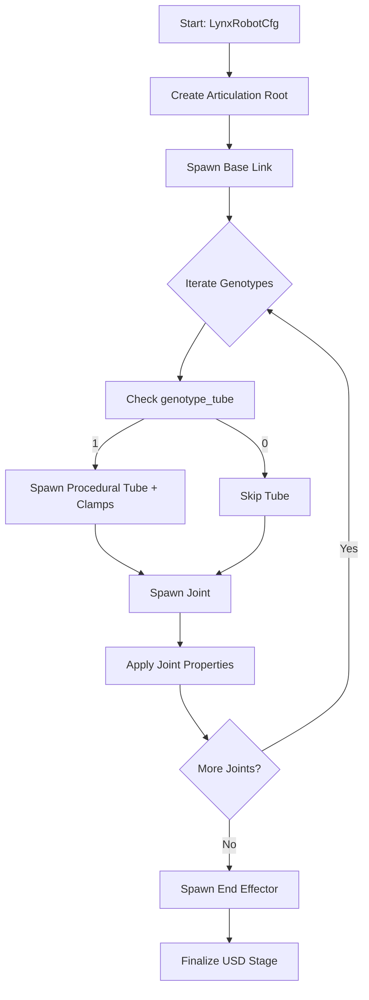

# Technical Specification: Lynx USD Constructor for IsaacLab

## 1. Overview
The `LynxUsdConstructor` is a procedural asset generator for IsaacLab that mirrors the modularity of the MuJoCo-based `constructor.py`. It allows for the programmatic assembly of a Lynx manipulator based on "genotypes" for tubes and joints, using USD (Universal Scene Description) as the underlying representation.

## 2. Class Structure

### `LynxUsdConstructor`
The main class responsible for spawning the robot into the Isaac Sim stage.

```python
class LynxUsdConstructor:
    """Procedural constructor for the Lynx manipulator in USD."""

    def __init__(self, cfg: LynxRobotCfg):
        self.cfg = cfg

    def spawn(self, prim_path: str):
        """Spawns the robot at the specified prim path."""
        # 1. Create Articulation Root
        # 2. Iterate through genotypes to build the chain
        # 3. Handle procedural tubes and STL clamps
        # 4. Configure joints and actuators
        pass

    def _build_chain(self, prim_path: str):
        """Internal logic to assemble the links and joints."""
        pass
```

## 3. Mapping: MuJoCo to USD/IsaacLab

| MuJoCo Element | USD / IsaacLab Equivalent | Implementation Detail |
| :--- | :--- | :--- |
| `body` | `UsdGeom.Xform` (Link) | Each link is an Xform with `UsdPhysics.RigidBodyAPI`. |
| `geom` (Cylinder) | `sim_utils.MeshCfg` (Cylinder) | Procedural tubes using `isaaclab.sim.spawners.meshes`. |
| `geom` (Mesh) | `sim_utils.MeshCfg` (STL) | Clamps and end-effectors loaded from STL files. |
| `joint` | `UsdPhysics.Joint` | Revolute joints with `UsdPhysics.DriveAPI`. |
| `actuator` | `ImplicitActuatorCfg` | IsaacLab actuator configuration for the articulation. |
| `site` | `UsdGeom.Xform` | Used for end-effector and sensor placement. |

## 4. Procedural Logic

### Genotype Handling
- **`genotype_joints`**: Determines the sequence of `JointInline` vs `JointOrthogonal`.
  - `True` (Inline): Joint axis aligned with the previous link's Z-axis.
  - `False` (Orthogonal): Joint axis perpendicular to the previous link's Z-axis.
- **`genotype_tube`**: A list (e.g., `[0, 1, 0, 1, 0]`) where `1` indicates a tube segment is inserted between joints, and `0` indicates direct connection.

### Assembly Flow
1. **Base**: Spawn the fixed base link.
2. **Recursive/Iterative Attachment**:
   - For each joint in the sequence:
     - If `genotype_tube[i] == 1`, spawn a `BSplineTubeWithClamps` equivalent.
     - Spawn the joint (Inline or Orthogonal).
     - Spawn the joint's visual/collision geometry (cylinders).
3. **Procedural Tubes**:
   - Use `sim_utils.MeshCfg` to create cylinder segments.
   - For B-Spline tubes, approximate with multiple short cylinder segments or a single deformed mesh if possible (initially, straight segments are recommended for simplicity).
4. **Asset Handling**:
   - **Clamps**: Load `clamp_0226.stl` using `sim_utils.MeshCfg`.
   - **End-Effector**: Load task-specific STLs (e.g., `CupModule`).

## 5. Configuration: `LynxRobotCfg`

```python
@configclass
class LynxRobotCfg(ArticulationCfg):
    """Configuration for the procedurally generated Lynx robot."""
    
    # Genotypes
    genotype_tube: list[int] = [0, 1, 0, 1, 0]
    genotype_joints: int = 2
    rotation_angles: list[float] = [180.0, 0.0, 0.0, -180.0, 0.0, 0.0]
    
    # Geometric Parameters
    tube_radiuses: list[float] = [0.0396] * 5
    clamp_length: float = 0.051
    clamp_stl: str = "source/isaaclab_assets/data/Robots/Lynx/models/clamp_0226.stl"
    
    # Physics/Actuation
    actuators: dict[str, ImplicitActuatorCfg] = {
        "lynx_arm": ImplicitActuatorCfg(
            joint_names_expr=["joint_.*"],
            stiffness=5000000.0,
            damping=1.0,
        )
    }
    
    # Spawning logic (overrides ArticulationCfg.spawn)
    spawn: sim_utils.SpawnerCfg = LynxUsdConstructorSpawnerCfg()
```

## 6. Mermaid Diagram: Assembly Workflow


